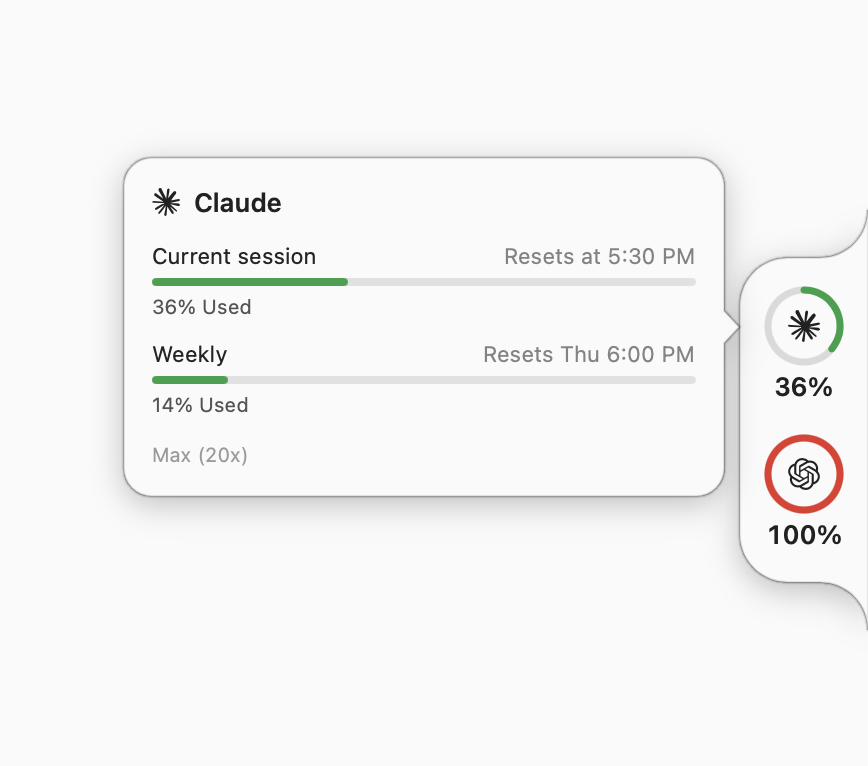
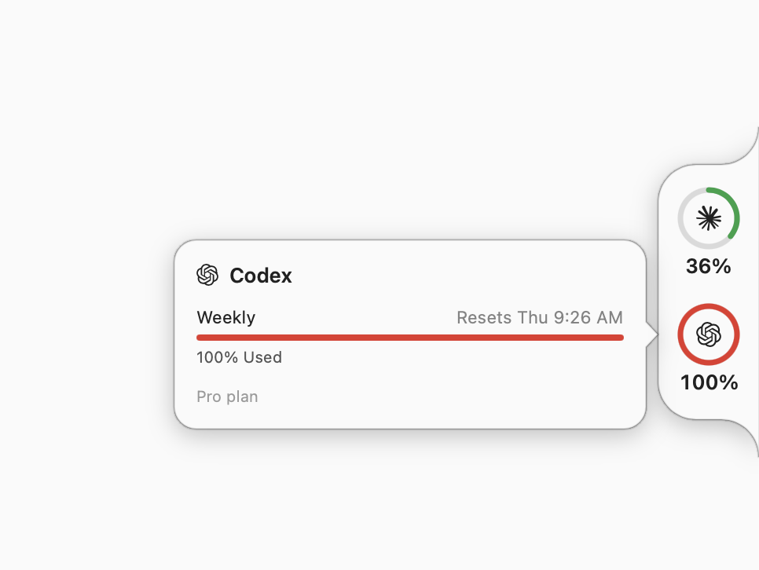

<p align="center"></p>

# Tachyon

Live rate-limit rings for Claude Code, Codex, Grok and Cursor, docked to the
edge of your screen. Native macOS, zero config.

<p align="center"></p>

<p align="center">
  <picture>
    <source media="(prefers-color-scheme: dark)" srcset="assets/screenshots/claude-dark.png">
    
  </picture>
  <picture>
    <source media="(prefers-color-scheme: dark)" srcset="assets/screenshots/codex-dark.png">
    
  </picture>
</p>

When a window overlaps the pill it collapses to a 5pt color sliver. Red sliver —
you're nearly out. Mouse to the edge to bring it back.

**[tachyon.maksim.sh](https://tachyon.maksim.sh)**

## Install

```sh
brew install --cask gonzih/tap/tachyon
```

or grab the notarized zip from [releases](https://github.com/Gonzih/tachyon/releases/latest).

From source:

```sh
./build.sh && cp -R build/Tachyon.app ~/Applications/
```

macOS 15+. `~/Applications` (or `/Applications`) is required for Launch at Login.

## How it works

It reads the credentials your harnesses already store and asks their own usage
endpoints. Nothing to sign into, nothing to configure.

| Provider | Source | Poll |
|---|---|---|
| Claude Code | `api.anthropic.com/api/oauth/usage` | 120s |
| Codex | `chatgpt.com/backend-api/wham/usage` + rollout-log fallback | 60s + on turn completion (FSEvents) |
| Grok | `cli-chat-proxy.grok.com/v1/billing` + unified-log fallback | 120s |
| Cursor | `api2.cursor.sh` DashboardService, token from `state.vscdb` (read-only) | 120s |

Credentials, in order: env override → Keychain → the harness's own auth file.
The first Claude read triggers one Keychain prompt — choose **Always Allow**
(the read goes through `/usr/bin/security`, so the approval sticks across
updates). Tachyon never refreshes anyone's tokens; an expired token shows `!`
and the popover names the command that fixes it.

Ring colors: green < 50%, yellow from 50, orange from 70, red from 90.
Hover a ring for per-window bars and reset times; click to pin.

`swift run Tachyon --smoke` prints what every provider detects, headlessly —
first thing to run if a ring is blank.

## Privacy

Talks to the four endpoints above and nowhere else. No telemetry. Overlap
detection reads window geometry only — no Screen Recording permission.

## Add your harness

Paste this into your coding agent — it adds itself:

```text
Add support for {YOUR HARNESS} to Tachyon, the macOS usage-rings app.

1. git clone https://github.com/Gonzih/tachyon and read CONTRIBUTING.md — it
   defines the UsageProvider protocol and the acceptance checklist.
2. Investigate how {YOUR HARNESS} stores credentials locally and where its
   usage/rate-limit data lives (endpoint, log files, or CLI output).
3. Implement Sources/Tachyon/Providers/{Name}Provider.swift on the pattern of
   GrokProvider.swift, add one line to ProviderRegistry, add a glyph.
4. Verify with `swift run Tachyon --smoke` — your provider must show real
   numbers, or degrade cleanly to "not signed in".
5. Open a PR titled "provider: {name}".
```

Humans welcome too: [CONTRIBUTING.md](CONTRIBUTING.md).

## License

MIT.

## Credits

Side-notch design concept by [@hivinz_](https://x.com/hivinz_/status/2092996055248126353).
Provider marks: simple-icons (CC0), Wikimedia Commons, lobehub icons (MIT).
